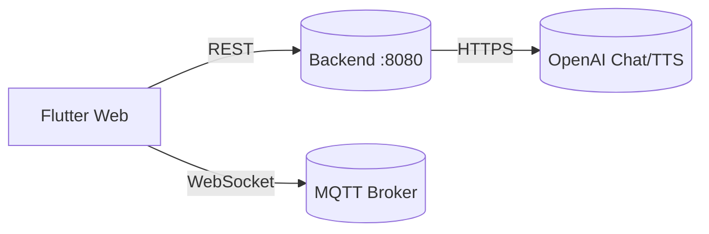

# ระบบสมาร์ทโฮม (Smart Home Web App) — สไลด์นำเสนอ (ภาษาไทย)

---

## 1) ภาพรวมโครงการ
- วัตถุประสงค์: ระบบติดตามและควบคุมอุปกรณ์ในบ้าน/ฟาร์มผ่านเว็บ (Flutter Web) พร้อมผู้ช่วย AI (สั่งด้วยเสียง/แชท)
- ความสามารถหลัก:
  - แดชบอร์ดเรียลไทม์ แสดงสถานะอุปกรณ์และกราฟเซนเซอร์
  - สั่งงานอุปกรณ์ (ไฟ/พัดลม/แอร์/ปั๊มน้ำ/ฮีทเตอร์/อุปกรณ์เสริม) ผ่าน API/MQTT
  - คำสั่งเสียง: แปลงเสียงเป็นข้อความ + AI วิเคราะห์เจตนา
  - ตอบกลับด้วยเสียง (TTS) ผ่านพร็อกซีฝั่งเซิร์ฟเวอร์
  - ระบบอัตโนมัติ (Automation) และบันทึกเหตุการณ์ (Log)

---

## 2) สถาปัตยกรรมโดยรวม
- ส่วนหน้า (Frontend): Flutter Web ให้บริการที่พอร์ต `:8088`
- ส่วนหลัง (Backend API): เซิร์ฟเวอร์กำหนดเองที่พอร์ต `:8080` (status/chat/control/sensors/history/tts)
- MQTT: ใช้สื่อสารเรียลไทม์/ควบคุมอุปกรณ์ (เดโมใช้ HiveMQ สำหรับเว็บ)
- AI ภายนอก: OpenAI (Chat + TTS) เรียกผ่านฝั่งเซิร์ฟเวอร์เท่านั้น

```mermaid
flowchart LR
  subgraph เบราว์เซอร์ (iPad/PC)
    UI[Flutter Web UI]
  end
  UI -- HTTP --> API[(Backend :8080)]
  UI -- WebSocket --> MQTT[(MQTT Broker)]
  API -- HTTPS --> OpenAI[(OpenAI APIs)]
```

---

## 3) โมดูลหลัก (ฝั่ง Frontend)
- `lib/screens/dashboard_screen.dart`
  - สถานะอุปกรณ์สด กราฟเซนเซอร์ ปุ่มควบคุมด่วน
  - ตัวตั้งเวลารีเฟรช + ผู้ฟัง MQTT
- `lib/screens/chat_screen.dart`
  - หน้า Log/แชทกับ AI, ปุ่มเปิด/ปิดเสียง TTS, ปุ่มเล่นคำตอบ
- `lib/services/api_service.dart`
  - เรียก `status`, `chat`, `control`, `sensors`, `history`
- `lib/services/voice_command_service.dart`
  - ท่อการทำงานคำสั่งเสียงครบวงจร (ฟัง-ตีความ-เล่นเสียงตอบ-สั่งอุปกรณ์)
- `lib/services/ai_service.dart`
  - วิเคราะห์คำสั่งด้วย OpenAI (`_processWithOpenAI`) หรือ fallback แบบ Local AI
- `lib/services/tts_service.dart`
  - TTS บนเว็บผ่านพร็อกซี `POST /api/tts` (คืน `audio/mpeg`)
- `lib/services/storage_service.dart`
  - เก็บค่าตั้งค่า (URL เซิร์ฟเวอร์, โหมด) และแคชข้อมูล
- `lib/utils/constants.dart`
  - กำหนด API base URL, endpoints, ค่าเริ่มต้น MQTT และค่าคงที่แอป

---

## 4) จุดให้บริการของ Backend (ที่คาดหวัง)
- `GET /api/status` — ตรวจสถานะระบบ
- `POST /api/chat` — แชทกับ AI (คีย์อยู่ฝั่งเซิร์ฟเวอร์)
- `POST /api/control` — ควบคุมอุปกรณ์
- `GET /api/sensors?limit=20` — ข้อมูลเซนเซอร์ล่าสุด
- `GET /api/history` — ประวัติการทำงาน/ควบคุม
- `POST /api/tts` — พร็อกซี TTS ไป OpenAI ส่งกลับเป็น `audio/mpeg`

หมายเหตุ:
- Backend ต้องรันที่ `0.0.0.0:8080` และเปิด CORS ให้ต้นทางเว็บ
- สำหรับ TTS: รับ `{ text, voice }` เรียก OpenAI แล้วคืนไฟล์เสียง MP3

---

## 5) การตั้งค่าเครือข่าย (ข้ามอุปกรณ์)
- เว็บ (Frontend): `http://<IP_ของพีซี>:8088`
- API (Backend): `http://<IP_ของพีซี>:8080`
- บน iPad ห้ามใช้ `localhost/127.0.0.1` ให้ใช้ IP ของพีซีแทน
- ตั้งค่า URL เซิร์ฟเวอร์ในหน้า Settings เป็น `http://<IP_ของพีซี>:8080`
- Windows Firewall (โปรไฟล์ Private): อนุญาตพอร์ต **8088** และ **8080**
- ตั้งค่า CORS Origin เป็น `http://<IP_ของพีซี>:8088`

---

## 6) ลำดับการไหลของข้อมูล AI/TTS
1) ผู้ใช้พิมพ์/พูดคำสั่ง
2) ส่วนหน้าเรียก `API :8080`
3) ฝั่ง API เรียก OpenAI (เก็บคีย์ไว้ที่เซิร์ฟเวอร์)
4) API ตอบกลับข้อมูลให้เว็บ
5) ถ้าเปิด TTS ระบบจะเรียก `POST /api/tts` พร้อม `{ text, voice }`
6) API คืน `audio/mpeg` และเบราว์เซอร์เล่นเสียงด้วย HTML5 Audio

---

## 7) ท่อการทำงานของคำสั่งเสียง
- STT: แพคเกจ `speech_to_text` (ตั้งค่า `th_TH`)
- วิเคราะห์เจตนาด้วย `AiService._processWithOpenAI()` หรือ `_processWithLocalAI()`
- ดำเนินการ: สั่งงานผ่าน API/MQTT แล้วอัปเดตสถานะและบันทึก
- ตอบด้วยเสียง: `TtsService.speakImmediate()` (บนเว็บเรียก `/api/tts`)

---

## 8) วิธี Build & Run (เครื่องท้องถิ่น)
- Build Flutter Web:
```bash
flutter build web --release
```
- ให้บริการหน้าเว็บ:
```powershell
python -m http.server 8088 --directory D:\Appiot\build\web --bind <IP_ของพีซี>
```
- รัน Backend ที่ `0.0.0.0:8080` และเปิด CORS ให้ `http://<IP_ของพีซี>:8088`
- บน iPad เปิด: `http://<IP_ของพีซี>:8088` แล้วตั้งค่า URL เซิร์ฟเวอร์เป็น `http://<IP_ของพีซี>:8080`

---

## 9) การตั้งค่าที่เกี่ยวข้อง
- `lib/utils/constants.dart`
  - `ApiConstants.baseUrl` เริ่มต้นเป็น `http://localhost:8080` (แก้ผ่าน Settings ได้)
  - `ApiConstants.ttsUrl = baseUrl + '/api/tts'`
- `lib/services/storage_service.dart`
  - `StorageConstants.serverUrlKey` ใช้เก็บ URL เซิร์ฟเวอร์ใน SharedPreferences
- MQTT เริ่มต้น: `MqttConstants.webSocketUrl = ws://broker.hivemq.com:8000/mqtt`

---

## 10) การแก้ปัญหาที่พบบ่อย (Troubleshooting)
- iPad เห็นหน้าเว็บแต่ “ข้อมูลไม่มา”:
  - ตั้ง URL เซิร์ฟเวอร์เป็น `http://<IP_ของพีซี>:8080`
  - Backend ต้องฟังที่ `0.0.0.0:8080`
  - ไฟร์วอลล์อนุญาตพอร์ต `8080`,`8088`
  - CORS อนุญาต Origin `http://<IP_ของพีซี>:8088`
- TTS ไม่มีเสียง (เว็บ/iOS):
  - ต้องมี `/api/tts` และคืน `audio/mpeg`
  - iOS ต้องมีการกดจากผู้ใช้ครั้งแรก เพื่ออนุญาตเล่นเสียง
  - เช็กคอนโซล: สถานะตอบกลับและข้อผิดพลาดการเล่น
- Service Worker แคชหนัก:
  - เปิดใน Private Mode หรือเพิ่ม `?v=<timestamp>` เพื่อเคลียร์แคช

---

## 11) สคริปต์สาธิต (5–7 นาที)
- เปิดแดชบอร์ด (การ์ดสถานะสด กราฟเซนเซอร์)
- สลับสถานะอุปกรณ์ (เช่น ไฟ/พัดลม) จาก UI
- แสดงการบันทึกเหตุการณ์ Automation
- เปิดแท็บ Log/Chat ส่งคำถามให้ AI แล้วกดปุ่มลำโพงเพื่อฟังคำตอบ
- ทดลองพูดคำสั่ง (เช่น “เปิดไฟ”) ได้ยินเสียงยืนยัน แล้วอุปกรณ์สลับสถานะ

---

## 12) แผนพัฒนาต่อ (Roadmap)
- สร้างแอปมือถือ Native (Android/iOS) พร้อม MQTT เบื้องหลัง
- เสริมความปลอดภัย Backend (ยืนยันตัวตน, HTTPS, บทบาทผู้ใช้)
- ปรับแต่งเสียง TTS และตัวเลือกโมเดลท้องถิ่นสำหรับออฟไลน์
- UI สำหรับแก้ไขกฎอัตโนมัติ พร้อมนำเข้า/ส่งออก
- แดชบอร์ดเทเลเมทรีและระบบแจ้งเตือน

---

## 13) เครดิต / เทคโนโลยีที่ใช้
- ฝั่งหน้า: Flutter Web, Provider, shared_preferences
- ฝั่งหลัง: (ตัวอย่าง) Node/Express หรือ FastAPI
- AI: OpenAI Chat + TTS (คีย์อยู่ฝั่งเซิร์ฟเวอร์)
- MQTT: HiveMQ (WebSocket) หรือโบรกเกอร์อุปกรณ์

---

## 14) ติดต่อโครงการ
- ชื่อโครงการ: Smart Home App
- เวอร์ชัน: 1.0.0
- ผู้ดูแล: คุณ

---

# ภาคผนวก — เนื้อหาบรรยายโครงงาน (ภาษาไทย)

## A) ที่มาและความสำคัญของโครงงาน
- บ้าน/ฟาร์ม/ออฟฟิศขนาดเล็กมักไม่มีระบบรวมศูนย์ในการดูสถานะและควบคุมอุปกรณ์ ทำให้ตรวจยากและใช้เวลามาก
- อุปกรณ์ IoT หลายยี่ห้อทำให้ผู้ใช้ต้องสลับหลายแอป โครงงานนี้รวม “แสดงผล-ควบคุม-สั่งงานด้วยเสียง-อัตโนมัติ” ไว้ในเว็บเดียว
- ใช้ AI วิเคราะห์ภาษามนุษย์ ช่วยให้สั่งงานได้ตรงความต้องการ โดยไม่ต้องคลิกเมนูซับซ้อน

## B) การนำไปใช้ประโยชน์
- บ้านอัจฉริยะ, ฟาร์ม/เรือนเพาะ, ห้องเซิร์ฟเวอร์/คลังสินค้า, งานสาธิต/การสอนด้าน IoT + AI

## C) ขอบเขตของโครงงาน
- มีให้: แดชบอร์ด, ควบคุมผ่าน API/MQTT, คำสั่งเสียง + AI + TTS, การเก็บค่าตั้งค่าและแคช, ออโต้รีเฟรช/Automation พื้นฐาน
- นอกขอบเขต (อนาคต): Auth/RBAC, แจ้งเตือนนอกเครือข่าย, แอปมือถือเนทีฟ, edge computing

## D) การออกแบบระบบเบื้องต้น
- แยก Frontend/Backend, Backend เป็นพร็อกซีไป OpenAI, ใช้ MQTT สำหรับเรียลไทม์



## E) คลาวด์และเว็บเซอร์วิสที่ใช้
- OpenAI (Chat/TTS), HiveMQ (ตัวอย่างสำหรับเว็บ), ตัวเลือกคลาวด์โฮสต์ (Azure/AWS/GCP) และ cloud tunnel

## F) การควบคุมและแสดงผล
- แสดง: การ์ดสถานะ, กราฟแบบเวลา, Log, รีเฟรชอัตโนมัติ
- ควบคุม: ผ่าน API/MQTT, โหมดอัตโนมัติ (ลอง API ก่อน สลับ MQTT หากล้มเหลว)
- TTS/Voice: เล่นเสียงผ่านปุ่ม (เหมาะกับ iOS ที่ต้องการ user gesture)
